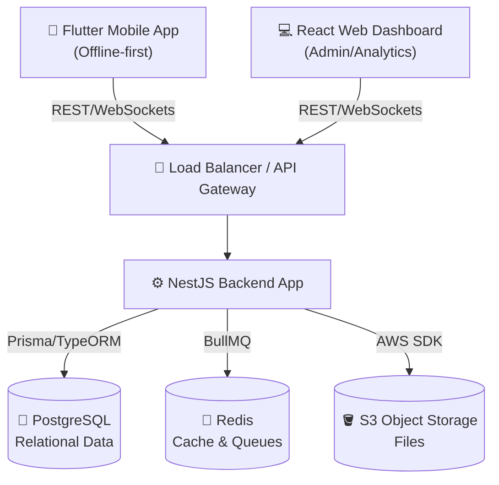

# OmniCampus System Architecture

## Architecture Overview
The system adopts a modern 3-tier architecture with separate layers for presentation (mobile/web), application logic (backend API), and data storage. We use a modular monolith approach in the backend to ensure clean boundaries while keeping deployments simple initially, with an easy path to microservices later.

### 1. Presentation Layer (Clients)
- **Web Admin Dashboard**: React, TailwindCSS, Vite. Single Page Application (SPA) consumed mainly by Admins, Chairmen, Principals, HODs, and Faculty (for desktop tasks).
- **Mobile Mobile App**: Flutter. Contains offline-first capabilities using a local SQLite/Drift database before syncing via API. Consumed mostly by Students and Faculty (attendance/quick actions).

### 2. API / Application Layer (Backend)
- **Backend Framework**: NestJS (Node.js). Selected for robust dependency injection, decorator-driven routing, and enterprise-grade maintainability.
- **Module Boundaries**:
  - `AuthModule`: JWT issuance, RBAC/ABAC guards, Passkeys validation.
  - `UsersModule`: Profile, roles, department mapping.
  - `ClassroomModule`: Classes, rosters, assignments, materials, grades.
  - `AttendanceModule`: Sessions, offline-sync reconciliation, QR logic, correction workflows.
  - `CommunicationModule`: Notices, broadcast, acknowledgement tracking.
  - `GrievanceModule`: Ticketing, SLA timers.
  - `AuditModule`: Intercepts events and writes immutable logs.
  - `AIModule`: Connects to LLM capabilities securely, logs explanations.

### 3. Data Storage & Infrastructure Layer
- **Primary Database**: PostgreSQL 16+. Relational data with JSONB for flexible fields.
- **Cache/Background Queue**: Redis. Used for rate limiting, session cache, and background processing via BullMQ (e.g., SLA timers, push notifications).
- **File Storage**: S3-compatible Blob Storage (AWS S3 or MinIO) for material attachments, user avatars, submission files. 
- **Real-time Layer**: Socket.IO/WebSockets natively via NestJS Gateways for dashboard live updates.

## Architecture Diagram (Textual / Mermaid)

